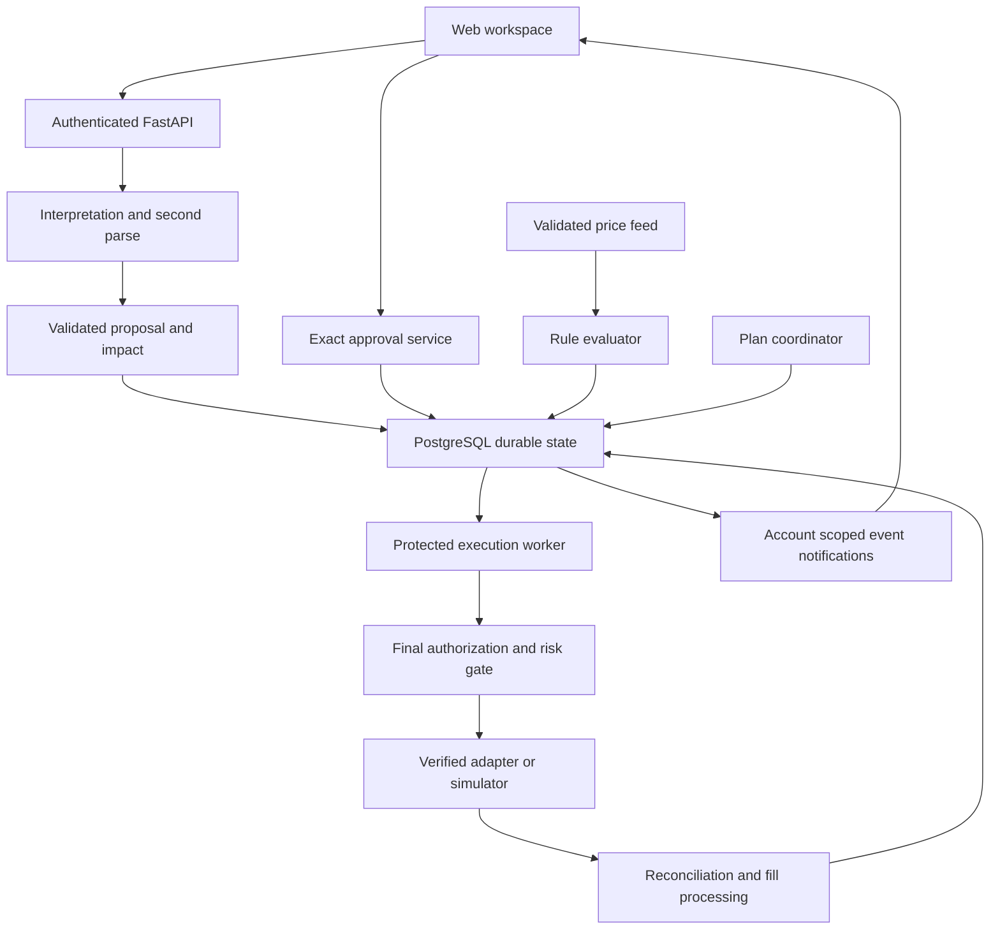

# TradeGuard architecture

Version 1.0 | Proposed application design | 8 October 2026

## 1 Authority boundaries

The model proposes; deterministic services validate; the authenticated trader authorizes exact terms; only a protected worker mutates the broker. A human approval, an operation and a broker order are separate objects. Their states must remain separate throughout the system.

The approval service also runs ownership and deterministic policy checks. Diagram arrows do not imply arbitrary database access: write privileges and service interfaces enforce the boundaries below. No model, frontend, feed consumer or coordinator has a direct mutation route to the broker.

## 2 Trust zones

| Zone | Components and data | Authority |
|---|---|---|
| Untrusted input | Browser payloads, original text, model output, stock names, external metadata | Supplies data; cannot authorize itself |
| Authenticated application | Sessions, queries, interpretation, previews, approval and rule/plan management | Validates and persists exact authorization and bounded pending work |
| Durable coordination | PostgreSQL terms, approvals, operations, rules, reservations, stop and receipts | Source of truth for local state and concurrency |
| Protected execution | Worker, final gate, broker mutation credentials | Submits only eligible exact operations and reconciles uncertain outcomes |
| External execution | Verified broker/exchange or isolated simulator | Determines acceptance and fills under its actual contract |

The API cannot access mutation credentials. If 021 offers only one unrestricted credential, use a protected gateway for read access as well; do not distribute that key to the API or model. Separate demo databases and credentials from any live connection.

## 3 Responsibilities and data ownership

| Component | Responsibilities | Must not do |
|---|---|---|
| Web client | Cards, explanations, approval reference, authoritative reload | Compute authoritative funds or submit broker terms |
| Session and access service | Actor, account membership, CSRF, rate limits | Trust browser actor IDs |
| Interpretation service | Structured proposal and independent original-text parse | Resolve disagreement by silently preferring the model |
| Query service | Numeric calculations, option filtering, data quality | Substitute invented missing values |
| Approval service | Immutable version binding and atomic activation | Treat a hash or chat text as permission |
| Admission service | Shared operation creation, reservations, stop checks | Create divergent rule and direct-order paths |
| Feed and rule evaluator | Fresh ordered ticks, conditions, durable one-shot consume | Send broker orders or replay unobserved crossings |
| Plan coordinator | Approved dependencies and per-leg eligibility | Resize or compensate without new approval |
| Execution worker | Final checks, persisted submission, protected adapter call | Retry uncertain mutation blindly |
| Reconciler | Resolve original operations and ingest fills | Interpret a missing lookup result as definite rejection |
| Event publisher | Account-scoped notifications after committed changes | Treat message delivery as financial state |

Member 1 owns the interface; Member 2 interpretation and approval; Member 3 durable execution; Member 4 queries, catalogue, feed and rules. Responsibilities are implemented as modules in one backend plus a separate worker process, not a required collection of microservices.

## 4 Direct action flow

1. Authenticate the request and resolve the selected account from authorized membership.
2. Parse the original request independently in the model and deterministic parser. Resolve stable catalogue identity and check agreement.
3. Validate supported fields, target-order revision, quote quality and preview policy. Persist a READY immutable proposal version with a random approval challenge and expiry.
4. Present stored terms and impact. The trader explicitly approves that proposal version.
5. In one database transaction, lock the proposal and account control/budget state; verify ownership, freshness of authorization and challenge; create approval, operation, reservations and audit evidence; mark proposal consumed.
6. The worker claims the operation exclusively. Immediately before dispatch, recheck authorization, deadline, stop, bounds, target state and quote requirements.
7. Persist SUBMITTING and attempt identity before calling the broker. Release the database transaction before the network request.
8. Persist an explicit acknowledgement or rejection. If the call may have reached the broker and its result is uncertain, persist UNKNOWN and reconcile the original identity.
9. Ingest actual broker order status and fill evidence, update reservations and account projections, then notify the UI after commit.

Cancellation does not need a current instrument price, but it does need a current target revision and approved cancellation identity. Modification and placement require the applicable quote and funding checks.

## 5 Concurrency and recovery

Use row-level locking and unique identities to serialize approval consumption, account budget reservations, rule consumption and leg admission. Lock resources in a documented stable order to avoid deadlocks. Retry a rolled-back database transaction only before any external side effect.

Work is durable in PostgreSQL. Claiming READY work is exclusive. A crashed SUBMITTING operation becomes UNKNOWN after its stale attempt is identified; it does not return to READY. A submitted action is not repeated merely because its worker lease expired.

ACKNOWLEDGED means the broker accepted the mutation request under verified semantics; it does not mean a trade filled. Fill processing deduplicates verified fill IDs or validated cumulative snapshots. If trustworthy deduplication information is absent, pause projection updates and report uncertain data.

Price or target drift that blocks an unsent operation produces HELD. The prototype never auto-releases HELD work. A user must review fresh terms, create a new proposal and approve again; atomically retire the unsent old work and adjust reservations so it cannot later execute. UNKNOWN work cannot be superseded as though definitely unsent.

## 6 Stop semantics

The persistent account stop serializes with local final dispatch admission. Stop acknowledgment means no operation may newly pass that admission boundary while stop remains active. A request that already crossed the boundary may still be sent or filled. This is an explicit in-flight limit, not an atomic transaction with the exchange.

The prototype stop blocks all new broker mutations, including cancel and modify. It does not automatically cancel open orders or liquidate. Resuming requires an explicit authenticated control action, increments the control revision and does not revive HELD work. Informational alerts continue as disclosed.

## 7 Rules and plans

Rule activation creates durable parent authorization. Its approval challenge expiry limits activation time; its separately approved valid_until limits later firing. On a qualifying fresh tick, atomically consume the rule and create either its bounded operation or its blocked result. A stale or stopped condition is not consumed. A risk-denied eligible firing is consumed under the visible one-shot policy.

Plan approval pins all legs and reserves conservative total commitment. Each leg can create at most one operation. Moving capacity from the plan reservation to a leg reservation does not charge it twice. A dependent leg requires confirmed full fill, never mere acknowledgement. Partial/rejected/UNKNOWN results hold advancement. Progress and reservations survive restart.

## 8 Realtime and Safety Arena

WebSockets carry committed notifications, not approval commands. Each account event has a durable monotonic sequence, object version and event ID. Delivery can be duplicated or missed. The client deduplicates and reloads HTTP state after reconnect or a gap. State can remain correct while notification is delayed.

Arena runs only with SIMULATOR accounts and the same production application services. It may inject bad interpretation, duplicate delivery, stale ticks and lost replies, but cannot directly bypass approval or call live adapters. Results record expected versus observed behaviour and accepted simulated action counts. Evidence labels distinguish injected faults from actual model behaviour.

## 9 Technology choices

| Layer | Choice | Reason |
|---|---|---|
| UI | React, TypeScript, Tailwind CSS | Typed cards and responsive trader workspace |
| Application | Python, FastAPI, Pydantic | Strict contracts and deterministic service validation |
| Model | Gemini structured output | Constrained proposal shape, with independent checks |
| Persistence | PostgreSQL; SQLAlchemy and Alembic if adopted | Transactions, locking, versioned changes and durable work |
| Execution | One separate Python worker polling PostgreSQL | Durable shared path without extra queue infrastructure |
| Updates | WebSockets plus HTTP reload | Fast status updates with durable truth |
| Verification | Pytest and integration checks | Observe approval, concurrency and failure properties |

## 10 Guidance and unresolved adapter contract

OWASP recommends showing significant transaction data, server-side enforcement, integrity of terms, operation-specific credentials and bounded authorization validity. TradeGuard applies these through stored exact terms and protected dispatch. This is design guidance, not certification. [OWASP Transaction Authorization](https://cheatsheetseries.owasp.org/cheatsheets/Transaction_Authorization_Cheat_Sheet.html).

Caller identities and defined retry semantics help make retries safe; an uncertain response does not justify repeating a financial side effect. TradeGuard therefore separates local deduplication from broker idempotency. [AWS Builders Library](https://aws.amazon.com/builders-library/making-retries-safe-with-idempotent-APIs/).

PostgreSQL locking can coordinate competing local transactions but cannot create an atomic commit with a remote broker. [PostgreSQL Explicit Locking](https://www.postgresql.org/docs/current/explicit-locking.html).

The 021 adapter must verify authentication, account scopes, instruments, feed timestamps/order, order bounds, product/validity types, modify/cancel semantics, lookup consistency, caller references, idempotency retention and fill evidence. A missing capability fails closed for the affected action. No API endpoint in this pack claims to be a 021 endpoint.
