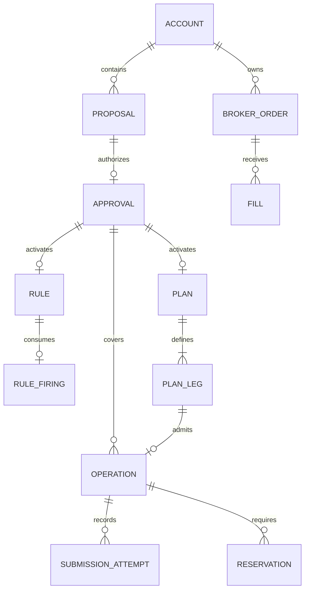

# TradeGuard data model

Version 1.0 | Logical PostgreSQL model | Proposed, not an existing schema

## 1 Shared types and conventions

All primary IDs are server-generated UUIDs. All timestamps are UTC ISO 8601 in the API and timezone-aware timestamps in storage. Trading-day boundaries come from verified market/account configuration, not the server's local date. Each mutable aggregate has a monotonically increasing integer version starting at 1.

Money and prices use decimal storage and decimal strings in JSON. Percentage thresholds use decimal strings; drift tolerance uses integer basis points. Order quantities are integer instrument units. Display lots separately using verified lot_size metadata; never confuse one lot with one unit. Prototype instruments must support these conventions or be rejected.

Mode is SIMULATOR, ORGANIZER_SANDBOX or LIVE. Account currency is explicit; prototype accounting is INR with no implicit FX conversion. A trading account belongs to one mode and broker connection. No route can switch its mode. Actor identity comes from the session, not request payload.

The model below describes fields and constraints; migrations must implement them with suitable PostgreSQL types, foreign keys, unique keys and service permissions. Canonical JSON terms are validated by versioned Pydantic models, not arbitrary JSON accepted into execution.

## 2 Entity relationships

An operation has exactly one approval and at most one rule-firing or plan-leg parent. A broker order can be associated with several operations over its life, such as placement, modification and cancellation. It is not one new order per mutation.

## 3 Identity catalogue and account evidence

| Entity | Important fields | Integrity and owner |
|---|---|---|
| users | id, identity_provider_subject, created_at | Unique external subject; authentication service |
| sessions | id, user_id, token_hash, csrf_secret_ref, expires_at, revoked_at | Never store plaintext session token; Member 2 |
| account_memberships | account_id, user_id, role | Unique membership; TRADER and READ_ONLY supported |
| accounts | id, broker_connection_ref, mode, currency, account_display_label | Mode immutable; no credentials returned to browser |
| account_controls | account_id, stop_active, version, reason, changed_by, changed_at | One per account; locks coordinate local dispatch |
| risk_profiles | account_id, version, max_quantity_units, max_order_notional, max_rule_notional, commitment_cap, fee_buffer_policy | Immutable revisions; API cannot silently weaken policy |
| instruments | id, broker_instrument_ref, exchange, symbol, display_name, asset_type, underlying, expiry, option_type, strike, lot_size, tick_size, catalogue_version | Display name is untrusted; stable identity and verified metadata |
| quotes | id, account_mode, instrument_id, price, source, source_event_id, source_sequence, market_timestamp, received_at, quality | Unique source event when available; only accepted ordered evidence is actionable |
| account_snapshots | id, account_id, source_revision, as_of, cash_available, source, quality, basis | Timestamped evidence; avoid double-counting local fills against refreshed broker snapshots |
| position_snapshots | snapshot_id, instrument_id, quantity_units, avg_entry_price, day_baseline, basis | Unique instrument per snapshot; unsupported margin positions identified |

Broker snapshots are authoritative external evidence; local fills are projected only after a verified snapshot watermark. If the adapter cannot relate snapshots to fills, mark projections uncertain and do not combine them blindly. Reservations adjust broker available funds only where the verified available-funds definition does not already include that commitment.

## 4 Conversation and exact authorization

| Entity | Important fields | Integrity |
|---|---|---|
| conversations | id, account_id, created_by | Account scoped |
| messages | id, conversation_id, role, original_text, created_at | Treat content as untrusted; retention policy applies |
| proposals | id, account_id, created_by, message_id, version, kind, state, terms_schema_version, canonical_terms, terms_hash, parser_report, preview, approval_challenge_hash, approval_expires_at, created_at | One immutable terms object per version; unique account/id/version reference |
| approvals | id, proposal_id, proposal_version, account_id, actor_id, terms_hash, approved_at, valid_until, state | Unique proposal/version; stored canonical terms remain reachable |

Proposal kinds: PLACE_ORDER, MODIFY_ORDER, CANCEL_ORDER, CREATE_RULE, CREATE_PLAN. Proposal states: READY, CONSUMED, SUPERSEDED, EXPIRED. Clarification responses are messages with parser reports; they are not approvable proposals.

Approval states are ACTIVE or REVOKED. ACTIVE is durable authorization of the exact resource; the proposal challenge itself is consumed. Direct authorization permits one operation only. Rule authorization permits one firing and its one exact action. Plan authorization permits one operation per approved leg. valid_until is part of approved terms; approval_expires_at is the deadline to activate the proposal.

Revocation prevents future local admissions and dispatch under that authorization. It cannot undo an already dispatched action. Store revocation actor, reason and timestamp in audit evidence.

### Canonical order terms

Common fields: account_id, mode, action, instrument_id, side, quantity_units, order_type=LIMIT, limit_price, product, time_in_force, valid_until, quote_policy and terms_schema_version. Product and time_in_force are adapter-verified values, not invented broker enums.

quote_policy is a tagged union. reference_kind=SNAPSHOT requires snapshot_quote_id; reference_kind=RULE_THRESHOLD requires reference_price and is valid only for a standing trade whose approved threshold equals that price. Both require max_quote_age_ms and max_drift_bps. A plan leg uses its approved snapshot and may be held after a long delay. Cancellation has no quote_policy. No worker may change the reference to avoid a drift failure.

MODIFY_ORDER additionally binds target_order_id, target_order_version, the observed original terms and full proposed replacement terms. CANCEL_ORDER binds target_order_id, target_order_version, instrument_id and observed_remaining_quantity_units; it has no executable price or placement quantity. A missing field is not filled from a mutable later default.

CREATE_RULE binds condition, reference basis, trigger_mode, full action, expiry and one-shot policy. CREATE_PLAN binds ordered leg identities, full terms, dependencies, FULL_FILL_REQUIRED policy, validity and conservative reservation assumptions. Terms canonicalization is deterministic, preserves decimal representation rules and rejects unknown schema versions.

## 5 Operations orders and fills

| Entity | Important fields | Integrity |
|---|---|---|
| operations | id, account_id, approval_id, action_identity, action, immutable_terms, state, hold_code, rule_firing_id nullable, plan_leg_id nullable, broker_order_id nullable, created_at, version | Unique account/action_identity; exact parent relationship validated |
| submission_attempts | id, operation_id, attempt_number, caller_reference, started_at, completed_at, outcome, broker_reference, response_digest | Created before network call; no secret-bearing raw response |
| broker_orders | id, account_id, broker_order_ref, instrument_id, side, quantity_units, filled_quantity_units, limit_price, status, version, source_revision, observed_at | Unique account/broker ref; normalized verified status |
| fills | id, broker_order_id, source_fill_id, quantity_units, price, fees, occurred_at, evidence_quality | Unique verified order/fill reference; cumulative-only adapters need a distinct deduplication strategy |
| reservations | id, account_id, approval_id, operation_id nullable, plan_id nullable, instrument_id nullable, kind, amount, quantity_units, state | FUNDS or INVENTORY; capacity transfer cannot double charge |

### Operation states

| State | Meaning | Allowed next state |
|---|---|---|
| READY | Durable authorized pending work | SUBMITTING, HELD, BLOCKED, SUPERSEDED |
| SUBMITTING | Dispatch recorded; external result may be unknown | ACKNOWLEDGED, REJECTED, UNKNOWN |
| UNKNOWN | External outcome not established | ACKNOWLEDGED or REJECTED only from authoritative evidence |
| ACKNOWLEDGED | Mutation accepted under verified adapter semantics | Terminal operation state; broker order still evolves |
| REJECTED | Proven not accepted | Terminal |
| HELD | Unsent work needs fresh trader review | SUPERSEDED only; never automatically READY |
| BLOCKED | Definitively denied before sending | Terminal |
| SUPERSEDED | Proven unsent work retired | Terminal |

An adapter without synchronous cancellation acceptance evidence returns UNKNOWN pending reconciliation. ACKNOWLEDGED for cancel does not claim the order is already canceled; its broker_order status supplies that truth.

Broker-order states: OPEN, PARTIALLY_FILLED, FILLED, CANCELLED, REJECTED, UNKNOWN. A cancelled order may retain nonzero filled quantity. Fill evidence can arrive out of order, so validate cumulative quantities and authoritative source revisions; do not infer terminal states solely from enum ordering. Internal target version changes when relevant terms, quantity, fills or status change.

Reservation states: ACTIVE, TRANSFERRED, RELEASED. Retain commitments while UNKNOWN. Confirmed fills convert reserved capacity into actual spend/inventory reduction; verified terminal unused remainders release capacity. Plan-to-leg transfer preserves total commitment. A rejected future leg does not reverse earlier spend.

## 6 Rules plans and outcomes

| Entity | Important fields | Integrity |
|---|---|---|
| rules | id, account_id, approval_id, condition, action, trigger_mode, status, valid_until, last_quote_id, last_condition_value, version | Status ARMED, PAUSED, CONSUMED or EXPIRED; exact authorized action |
| rule_firings | id, rule_id, source_quote_id, outcome, operation_id nullable, alert_id nullable, reason, fired_at | Unique rule_id; TRADE_ADMITTED, ALERT_CREATED or BLOCKED |
| alerts | id, account_id, rule_firing_id, message, created_at, read_at | Unique rule firing; reading has no trading side effect |
| plans | id, account_id, approval_id, status, valid_until, version | APPROVED, RUNNING, HELD, COMPLETED, PARTIALLY_COMPLETED or FAILED |
| plan_legs | id, plan_id, leg_index, terms, depends_on_leg_id nullable, dependency_policy, status, operation_id nullable | Unique plan/index and operation parent; no cycles or cross-plan dependency |

Leg states: WAITING, READY, ADMITTED, HELD, FILLED, REJECTED, BLOCKED. Partial fills remain visible through the linked broker order; a dependent leg becomes HELD. HELD plan/leg state is not revived by a stop resume. COMPLETED means all required legs filled; PARTIALLY_COMPLETED or HELD must disclose remaining exposure. FAILED means no successful fill and no unresolved submission; UNKNOWN prevents final failure claims.

Rule consume, firing creation, bounded operation or alert creation, reservations and audit occur atomically. A risk-denied eligible firing creates a BLOCKED firing with no broker operation. Stop/stale feed pauses evaluation without consumption. Plan leg admission and reservation transfer occur atomically with unique parent identity.

## 7 Audit events and Arena

| Entity | Fields | Rules |
|---|---|---|
| audit_events | id, account_id, account_sequence, actor_type, actor_id, event_type, object_id, object_version, operation_id, payload_digest, created_at, prev_digest optional, event_hmac optional | Serialized sequence; append-only application permissions; hash/HMAC feature optional |
| account_events | event_id, account_id, sequence, type, object_id, object_version, committed_at, sanitized_payload | Persist in transaction with change; account-scoped sequence for notifications |
| arena_runs | id, account_id, scenario, injected_faults, expected_result, observed_result, assertion_results, accepted_action_count, status, started_at, finished_at | SIMULATOR only; observed evidence rather than hardcoded pass |

Account sequence allocation is transactional and serialized, so client gaps indicate missing notifications rather than committed rolled-back events. Audit digests provide some tamper detection only when implemented with protected keys/anchors; they do not defeat a privileged attacker who can alter both data and verification roots.

## 8 Required transaction boundaries

1. Direct approval: consume proposal, insert approval, operation, reservations and events together.
2. Rule/plan activation: consume proposal, insert approval and parent resource, reserve plan budget where required and append events together.
3. Rule firing: verify active approved parent and fresh tick, consume once, create firing and bounded effect or blocked outcome together.
4. Plan admission: verify parent, dependency and uniqueness; transfer reservation and create leg operation together.
5. Dispatch: serialize against account stop, verify authorization/risk, exclusively change READY to SUBMITTING and persist attempt before external call.
6. Outcome/fill ingestion: deduplicate evidence, update order/projection/reservations and append events together.

Use a stable lock order: account_controls, account budget/reservations, proposal or parent resource, then operation. Final approval/dispatch must also observe revocation and control revisions. Do not hold database locks through broker network calls. Broker calls remain outside local database atomicity.
